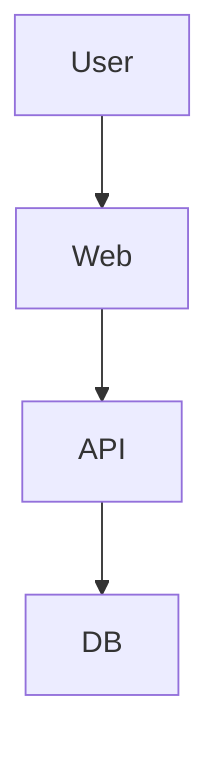

# Product Requirements Document: <Project Name>

## Executive Summary

Describe the product, users, problem, and MVP success statement.

## Principles

-

## Users

| User | Need |
| ---- | ---- |
|      |      |

## Scope

| Module | In Scope | Out of Scope |
| ------ | -------- | ------------ |
|        |          |              |

## Functional Requirements

1.

## Architecture

## Success Metrics

-

## Phase Plan

| Phase | Goal | Deliverables |
| ----- | ---- | ------------ |
|       |      |              |
