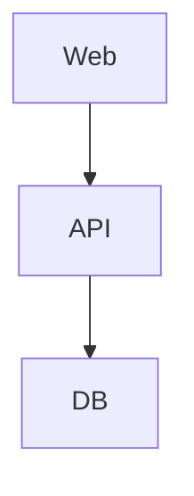

# Architecture Specification

## System Shape

Describe apps, packages, services, and deployable units.

## Runtime Architecture

## Modules

| Module | Responsibility |
| ------ | -------------- |
|        |                |

## Boundary Rules

-

## Critical Flows

-
