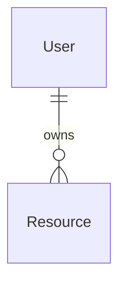

# Database Specification

## Principles

-

## Entity Map

## Models

### ModelName

- `id`
- `createdAt`
- `updatedAt`

## Indexes and Constraints

| Table | Index/Constraint | Purpose |
| ----- | ---------------- | ------- |
|       |                  |         |

## Migration Rules

-
