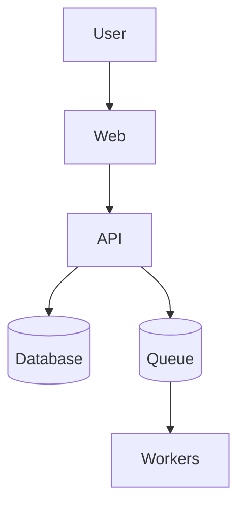

# CONSTITUTION.md

This file governs all AI-agent and human contributor behavior in this repository. Agents read this on every session to understand what they are building, how the system works, and what rules are non-negotiable.

---

## Project Overview

- **Product**: <!-- name and one-line description -->
- **Users**: <!-- who uses it -->
- **Problem**: <!-- what it solves -->
- **Phase**: MVP | Beta | Production
- **Team size**: <!-- number of contributors -->
- **Repository**: <!-- GitHub URL -->

---

## Architecture North Star

<!-- Describe the intended architecture: apps, services, packages, data flow, and non-negotiable layer boundaries. Include a Mermaid diagram if it clarifies the shape. -->



Key boundaries:
- <!-- e.g. "Controllers are thin — business logic lives in services" -->
- <!-- e.g. "Cross-module communication via EventEmitter or queues only" -->
- <!-- e.g. "No direct database access from the web app" -->

---

## Tech Stack

| Area | Technology | Version | Purpose |
| ---- | ---------- | ------- | ------- |
| Runtime | | | |
| Web framework | | | |
| API framework | | | |
| Database | | | |
| ORM / query builder | | | |
| Queue / cache | | | |
| Auth | | | |
| Email | | | |
| File storage | | | |
| Unit testing | | | |
| E2E testing | | | |
| CI/CD | | | |
| Hosting | | | |

---

## Commands

```bash
# Install dependencies


# Start backing services (Docker, etc.)


# Start development


# Build


# Lint


# Typecheck


# Unit tests


# E2E tests


# Database: migrate


# Database: seed / reset
```

---

## Project Structure

```text
<!-- Top-level directory map. Describe what each dir owns. -->

src/ or apps/
  api/         — backend API
  web/         — frontend
packages/      — shared code
.claude/       — AI workflow scaffold
.github/       — CI and templates
```

---

## Code Rules

### General

- Scope changes to the active issue. Do not refactor unrelated code.
- Match existing patterns in the file being edited.
- No new libraries without an issue and approval.
- Update `.claude/reference/` docs when architecture, API, schema, or testing contracts change.
- Add tests proportional to the risk of the change.
- Never commit `.env`, secrets, API keys, or credentials.

### Backend

- <!-- e.g. "Business logic lives in services, not controllers" -->
- <!-- e.g. "Money operations use db transactions and are idempotent" -->
- <!-- e.g. "Async jobs (email, notifications) go through the queue" -->

### Frontend

- <!-- e.g. "Server state in React Query, not Context" -->
- <!-- e.g. "No direct API calls in components — use hooks" -->
- <!-- e.g. "Tailwind utility classes only, no custom CSS files" -->

### Database

- <!-- e.g. "All migrations are additive and reversible" -->
- <!-- e.g. "Unique constraints and foreign keys enforced at DB level" -->
- <!-- e.g. "Never delete columns in a migration — deprecate first" -->

---

## GitHub Workflow

- Every unit of work starts as a GitHub issue.
- Every code change ships through a PR linked to an issue.
- Branch naming: `<type>/<kebab-case-description>`
  - Examples: `feat/user-auth`, `fix/payment-webhook`, `chore/upgrade-deps`
- PR title follows Conventional Commits format: `<type>(<scope>): <description>`
- Required checks before merge: lint, typecheck, build, tests.
- Do not merge without passing checks and at least one approval.
- Do not push directly to `main`.

---

## Team

| Role | Handle | Owns |
| ---- | ------ | ---- |
| | | |

---

## Validation Gate

The following must pass before any commit is handed off for review:

```bash
# Replace with the actual commands for this project
```

---

## Non-Negotiables

Rules that must never be broken regardless of deadline pressure:

1. <!-- e.g. "Never skip the validation gate" -->
2. <!-- e.g. "Never commit secrets" -->
3. <!-- e.g. "Every PR links to an issue" -->
