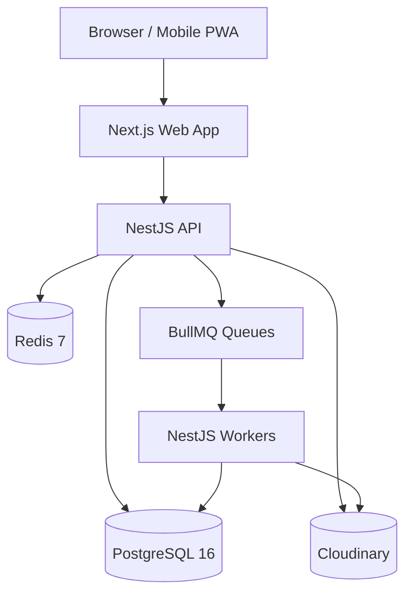
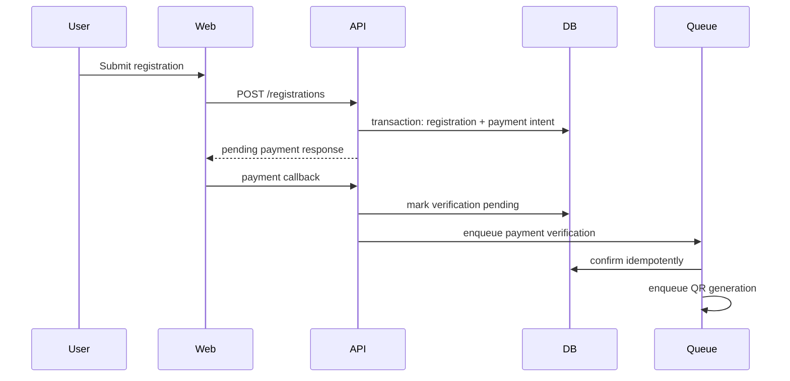
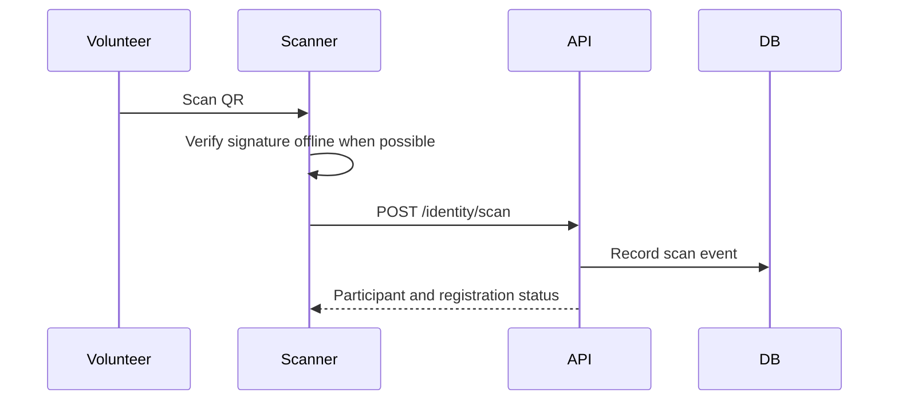
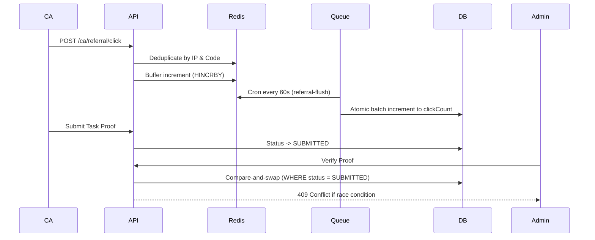

# Infinito 2K26 Architecture Specification

## 1. System Shape

Infinito uses a Turborepo monorepo with a Next.js frontend and NestJS backend. The backend is a modular monolith: one deployable API with strong internal module boundaries.

```text
apps/web       Next.js App Router frontend
apps/api       NestJS API and future worker entrypoints
packages/ui    Shared UI primitives
packages/types Shared TypeScript contracts
reference/     Durable architecture, API, database, testing docs
```

## 2. Runtime Architecture



## 3. Backend Modules

| Module        | Responsibility                                      |
| ------------- | --------------------------------------------------- |
| Config        | Validate env and expose typed config                |
| Prisma        | Database client lifecycle and transactions          |
| Common        | response envelope, exceptions, logging, request IDs |
| Health        | readiness checks for API, DB, Redis, storage        |
| Auth          | register, login, refresh, logout, guards, RBAC      |
| Users         | profiles, roles, audit metadata                     |
| Events        | event catalog and admin event management            |
| Registration  | teams, participants, registration status            |
| Payments      | Razorpay orders, webhooks, reconciliation           |
| Identity      | signed QR credential generation and validation      |
| Notifications | email, push, in-app notifications                   |
| Schedule      | fixtures, venues, match timelines                   |
| Leaderboard   | standings, scores, live updates, redis cache fallbacks|
| Admin         | operational dashboards, brands, ca-tasks, task verification (compare-and-swap) |
| CA            | Campus Ambassador onboarding, referral links, tasks, proofs |
| Leads         | Waitlist capture and pre-registration CRM           |

## 4. Boundary Rules

- Controllers do not contain business logic.
- DTOs validate shape, not domain behavior.
- Services own domain behavior.
- Repositories/data access stays behind module services.
- Modules do not reach into another module's internals.
- Cross-module side effects use domain events or queues.
- Payments, QR generation, email, and notifications run asynchronously.

## 5. Critical Flows

### Registration



### QR Check-In



### CA Portal Async Tracking & Validation



Role promotion to `CAMPUS_AMBASSADOR` happens either directly via `PATCH /admin/users/:id/role`, or through the application queue: `POST /ca/apply` creates a `PENDING` `CAApplication`, `PATCH /admin/ca-applications/:id/review` approves or rejects it — approval promotes the role in the same compare-and-swap transaction as the status update, using the identical CAS pattern shown above for task verification.

## 6. Deployment Assumptions

- Local development uses Docker Compose for PostgreSQL and Redis, and Cloudinary for object storage.
- Production should use managed PostgreSQL, managed Redis, Cloudinary storage, HTTPS, and environment-level secrets.
- CI should run lint, typecheck, build, tests, and migration checks before merge.
