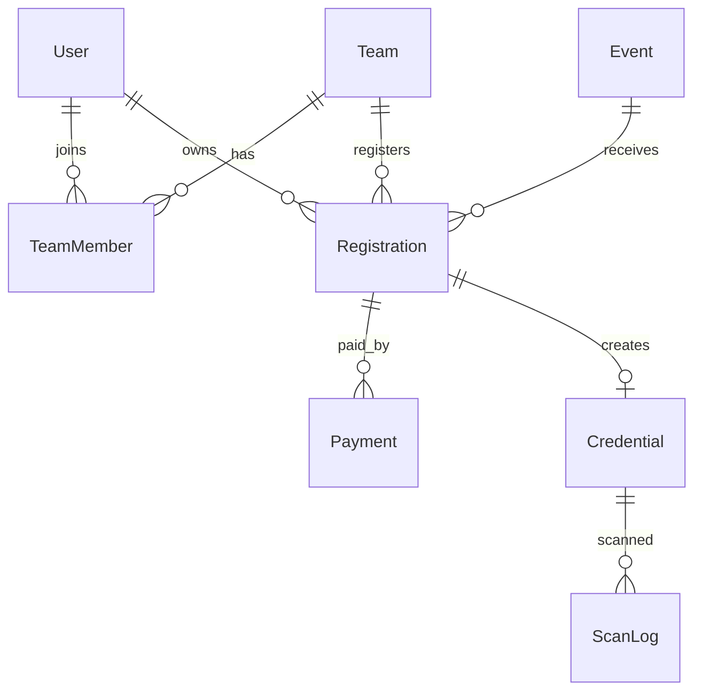

# Infinito Database Specification

## 1. Database Principles

- PostgreSQL is the source of truth.
- Prisma owns schema and migrations.
- Use UUID primary keys for business entities.
- Use enums for roles and statuses.
- Use soft deletes on auditable domain entities.
- Use unique constraints for invariants, not application-only checks.

## 2. Core Entity Map

## 3. MVP Models

### User

- `id` UUID primary key
- `email` unique
- `passwordHash`
- `name`
- `phone`
- `role` enum
- `createdAt`, `updatedAt`, `deletedAt`

### Event

- `id` UUID primary key
- `name`, `slug`
- `category`
- `description`
- `teamSizeMin`, `teamSizeMax`
- `capacity`
- `price`
- `isPublished`, `registrationOpen`
- `createdAt`, `updatedAt`, `deletedAt`

### Team

- `id` UUID primary key
- `name`
- `captainId`
- `collegeName`
- `inviteCode` unique
- `createdAt`, `updatedAt`, `deletedAt`

### TeamMember

- `id` UUID primary key
- `teamId`
- `userId`
- `role` enum: `CAPTAIN`, `MEMBER`
- Unique: `(teamId, userId)`

### Registration

- `id` UUID primary key
- `eventId`
- `userId` nullable for team registrations
- `teamId` nullable for individual registrations
- `status` enum: `PENDING_PAYMENT`, `CONFIRMED`, `WAITLISTED`, `CANCELLED`, `REFUNDED`
- `createdAt`, `updatedAt`, `deletedAt`
- Unique: `(eventId, teamId)` where `teamId` is not null
- Unique: `(eventId, userId)` where `userId` is not null

### Payment

- `id` UUID primary key
- `registrationId`
- `gatewayOrderId` unique
- `gatewayPaymentId` nullable unique
- `amount`
- `status` enum: `INITIATED`, `SUCCESS`, `FAILED`, `REFUNDED`, `RECONCILIATION_PENDING`
- `webhookVerified`
- `idempotencyKey` unique
- `createdAt`, `updatedAt`

### Credential

- `id` UUID primary key
- `registrationId` unique
- `subjectUserId`
- `tokenHash` unique
- `qrImageUrl`
- `lastScannedAt`
- `scanCount`
- `createdAt`, `updatedAt`

### ScanLog

- `id` UUID primary key
- `credentialId`
- `scannedById`
- `venue`
- `result` enum: `VALID`, `INVALID`, `DUPLICATE`, `EXPIRED`
- `metadata` JSON
- `createdAt`

## 4. Required Indexes

| Table        | Index                             | Purpose                                    |
| ------------ | --------------------------------- | ------------------------------------------ |
| User         | unique email                      | Login lookup                               |
| Event        | unique slug                       | Public event detail                        |
| Event        | `(isPublished, registrationOpen)` | Public listing                             |
| Team         | unique inviteCode                 | Join flow                                  |
| Registration | `(eventId, status)`               | Admin event dashboard                      |
| Registration | unique `(eventId, teamId)`        | Prevent duplicate team registrations       |
| Registration | unique `(eventId, userId)`        | Prevent duplicate individual registrations |
| Payment      | unique gateway order/payment IDs  | Webhook idempotency                        |
| Credential   | unique registrationId             | One credential per registration            |
| ScanLog      | `(credentialId, createdAt)`       | Scan history                               |

## 5. Migration Rules

- Migration PRs must include the generated Prisma migration.
- Migration PRs must describe rollback risk.
- Any required seed data must be scripted, not manually entered.
- Do not change enum values casually; document compatibility impact.
