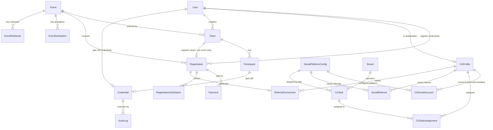

# Infinito Database Specification

> **Version:** 2.2 — Social referral system redesigned. `SocialPlatform` enum replaced by admin-configurable `SocialPlatformConfig` model. `SocialReferral` model added for multi-platform, multi-metric referral attribution with per-platform verification levels. `CaTask` extended with platform targeting and content fields.
> **Supersedes:** v2.1 (esports custom fields, per-player Participant model)

---

## 1. Database Principles

- PostgreSQL is the source of truth.
- Prisma owns schema and migrations.
- Use UUID primary keys for all business entities.
- Use enums for roles, statuses, and type discriminators.
- Use soft deletes (`deletedAt`) on all auditable domain entities.
- Use unique constraints for invariants — never application-only checks.
- Money amounts: `Decimal` (never `Float`).
- All timestamps: UTC.

---

## 2. Entity Map



---

## 3. Enums

```prisma
enum UserRole {
  SUPER_ADMIN
  ADMIN
  MODERATOR
  VOLUNTEER
  CAMPUS_AMBASSADOR
  PARTICIPANT
}

enum AdminService {
  EVENTS
  REGISTRATIONS
  PAYMENTS
  MERCH
  TEAMS
  CONTENT   // "Team" org-bio admin page — not the whole Content module
  GALLERY
  IDENTITY  // Gate Scans admin page
  SETTINGS
  CA        // CA tasks/applications; Brand/sponsor management is SPONSORS
  SPONSORS  // Brand model — sponsor tiers + public /sponsors listing
  LEADS
  LEADERBOARD
  UPLOADS
  ADMIN_USERS
}

enum BroadCategory {
  OUTDOOR
  INDOOR
  ESPORTS
  CULTURAL
  TECHNICAL
}

enum EventRegistrationType {
  INDIVIDUAL
  TEAM
}

// OPEN = no gender restriction (same as Mixed).
// MEN / WOMEN covers senior categories; BOYS / GIRLS are not used — map to MEN / WOMEN.
enum GenderCategory {
  OPEN
  MEN
  WOMEN
}

enum FeeStructure {
  FLAT         // fixed amount per team/individual
  PER_HEAD     // fee × number of players (Chess, Athletics, Mr. Infinito)
  GENDER_BASED // different amounts for MEN vs WOMEN brackets
}

enum CustomFieldType {
  TEXT
  NUMBER
  SELECT
  FILE
}

// Where a custom field is rendered in the registration form.
// TEAM fields appear once per registration (e.g. "Any queries?").
// PARTICIPANT fields appear once per player row (e.g. IGN, Game ID for esports).
enum CustomFieldScope {
  TEAM
  PARTICIPANT
}

enum SubOptionType {
  INDIVIDUAL  // athlete competes solo (100m, Long Jump)
  RELAY       // requires teammate names (4×100m)
}

enum ParticipantRole {
  CAPTAIN
  VICE_CAPTAIN
  PLAYER
  SUBSTITUTE
}

// COLLEGE_ID for teams from registered institutions.
// Government IDs for club / external / individual participants.
enum IdentityType {
  COLLEGE_ID
  AADHAR
  PAN
  DRIVING_LICENSE
  PASSPORT
  VOTER_ID
}

enum RegistrationStatus {
  PENDING_PAYMENT
  CONFIRMED
  WAITLISTED
  CANCELLED
  REFUNDED
}

enum PaymentMode {
  ONLINE             // Razorpay / gateway
  MANUAL_SCREENSHOT  // screenshot + transaction ID submitted by registrant
}

enum PaymentStatus {
  INITIATED
  SUCCESS
  FAILED
  REFUNDED
  RECONCILIATION_PENDING
}

// Direction recorded by volunteer at every gate scan.
enum ScanDirection {
  ENTRY
  EXIT
}

enum ScanResult {
  VALID
  INVALID
  DUPLICATE
  EXPIRED
}

// SocialPlatform enum removed in v2.2.
// Platform identity is now admin-managed via the SocialPlatformConfig model.
// Seed data pre-populates Instagram, Twitter, YouTube, LinkedIn as defaults.

// How a SocialReferral action was confirmed.
// BEHAVIORAL = session window + OAuth identity + incentive gate (used for Instagram — API cannot verify follows).
// API_CONFIRMED = OAuth + platform API call verified the action (YouTube subscriptions, Twitter follows).
enum VerificationLevel {
  BEHAVIORAL
  API_CONFIRMED
}

enum TaskSource {
  MODERATOR  // assigned by event manager / internal team
  BRAND      // assigned by team on behalf of a sponsor brand
}

enum TaskCategory {
  REFERRAL
  SOCIAL_MEDIA
  PHYSICAL
  CONTENT
  COMMUNITY
}

// AUTO requires a connected social account with API access.
// SCREENSHOT / PHOTO are the default for social media tasks at launch.
enum ProofType {
  AUTO             // fetched automatically from social API (Phase 2)
  URL_SUBMISSION   // CA submits URL; API fetched on demand
  SCREENSHOT
  PHOTO
}

enum TaskStatus {
  PENDING
  SUBMITTED
  VERIFIED
  REJECTED
}

// Public-facing sponsor tier, shown on the /sponsors page. Null on a Brand
// means it's a CA-task-only brand, not a public sponsor.
enum SponsorTier {
  TITLE
  GOLD
  SILVER
  BRONZE
  ASSOCIATE
}

enum MerchOrderStatus {
  PENDING_PAYMENT
  CONFIRMED
  SHIPPED
  DELIVERED
  CANCELLED
}
```

---

## 4. Models

### User

The only entity that can authenticate. Team players do **not** need a User account — only the captain does. IITP students are verified via Microsoft OAuth on `.iitp.ac.in` domain; no manual flag setting.

| Field | Type | Notes |
|-------|------|-------|
| `id` | UUID PK | |
| `email` | String unique | Primary login email |
| `passwordHash` | String? | Null if user registered via OAuth only |
| `name` | String | |
| `phone` | String? | |
| `role` | UserRole | Default: PARTICIPANT |
| `college` | String? | Institution name |
| `isIITP` | Boolean | Default false. Set to true after IITP OAuth verification. Triggers ₹0 fee. |
| `iitpEmail` | String? unique | `.iitp.ac.in` email confirmed via Microsoft OAuth. Null for non-IITP users. |
| `isIITPVerified` | Boolean | Default false. True only after successful Microsoft OAuth on `.iitp.ac.in`. |
| `isEmailVerified` | Boolean | Default false |
| `bannedAt` | DateTime? | Set/cleared via `PATCH /admin/users/:id/status`. Distinct from `deletedAt` — see below. |
| `customRoleId` | UUID? FK → CustomRole | Optional scoped admin-panel access layered on top of `role`. Assigned via `PATCH /admin/users/:id/custom-role` (SUPER_ADMIN only). See `CustomRole` below. |
| `createdAt` | DateTime | |
| `updatedAt` | DateTime | |
| `deletedAt` | DateTime? | Soft delete |

**IITP verification flow:** User initiates "Verify IITP" → Microsoft OAuth → redirect with `.iitp.ac.in` token → backend confirms domain, sets `iitpEmail`, `isIITPVerified = true`, `isIITP = true`.

**Why `bannedAt` is not `deletedAt`:** `deletedAt` is used elsewhere in soft-delete conventions; overloading it for "banned" risks a future soft-delete feature accidentally un-banning someone, or a ban accidentally triggering delete-semantics somewhere that checks `deletedAt`. A distinct column removes that ambiguity. `POST /auth/login` and `POST /auth/refresh` both reject (403) when `bannedAt` is set, and the ban call revokes the target's refresh token immediately (`RefreshTokenStore.revoke`) — but an already-issued access token (default 15m expiry) stays valid until it naturally expires, since the JWT strategy validates tokens from their signed claims only, without a DB lookup per request.

---

### PasswordResetToken

One row per forgot-password request. A 6-digit numeric code (`crypto.randomInt(100000, 999999)`) is emailed to the user (via the `password-reset-email` BullMQ queue) and never stored — only its SHA-256 hash is, matching the same pattern `RedisRefreshTokenStore` uses for refresh tokens. The user types the code back in on the reset-password page rather than clicking a link — see `POST /auth/reset-password` in `api.md`.

| Field | Type | Notes |
|-------|------|-------|
| `id` | UUID PK | |
| `userId` | UUID FK → User | |
| `tokenHash` | String unique | SHA-256 of the 6-digit code sent by email |
| `expiresAt` | DateTime | 30 minutes from creation |
| `usedAt` | DateTime? | Set on successful reset; a used or expired token is rejected |
| `failedAttempts` | Int | Default 0. Incremented on each wrong code; locked out (rejected) at 5 |
| `createdAt` | DateTime | |

Lookup for a reset is scoped by `(userId, usedAt: null, expiresAt > now)` ordered newest-first — not a global `tokenHash` lookup, since a 6-digit code (~1M possibilities) doesn't have the entropy for a link-token-style unique reverse-hash index to be safe against guessing; scoping to a specific user (resolved from the `email` in the request body) plus the `failedAttempts` lockout is the actual defense.

---

### SiteSettings

Single-row config editable from `/admin/settings`, so payment details and fest
dates can change without a code deploy. Always read/written via the fixed id
`"singleton"` (a typed table, not a generic key-value store — see
`SettingsService`). Public `GET /settings` returns nulls for every field until
an admin first sets them; consumers fall back to their previous hardcoded
constants when a field is null so a fresh deploy isn't blank.

| Field | Type | Notes |
|-------|------|-------|
| `id` | String PK | Always `"singleton"` |
| `upiVpa` | String? | |
| `upiPayeeName` | String? | |
| `paymentQrImageUrl` | String? | `UploadsService` storage key, signed at read time |
| `festStartAt` | DateTime? | Drives the landing-page countdown target |
| `festEndAt` | DateTime? | |
| `registrationCloseAt` | DateTime? | |
| `dateRangeLabel` | String? | Display string, e.g. "9-11 October 2026" — kept separate from the raw dates so prose formatting isn't computed ad-hoc per component |
| `updatedAt` | DateTime | |
| `updatedByUserId` | UUID FK → User? | |

**Known gap:** the landing hero image (`main-desktop.png`/etc) has the fest
theme title and dates baked into the artwork's pixels — changing
`SiteSettings` does not and cannot change what the hero image itself displays.

---

### EmailVerificationToken

One row per verification email sent (register, or a resend). Same shape and hashing pattern as `PasswordResetToken`. Skipped entirely for users who already have `isIITPVerified = true` — a confirmed `.iitp.ac.in` OAuth login already proves a real institute email.

| Field | Type | Notes |
|-------|------|-------|
| `id` | UUID PK | |
| `userId` | UUID FK → User | |
| `tokenHash` | String unique | SHA-256 of the raw token sent by email |
| `expiresAt` | DateTime | 24 hours from creation |
| `usedAt` | DateTime? | Set on successful verify; a used or expired token is rejected |
| `createdAt` | DateTime | |

---

### AdminAuditLog

Accountability record for admin user-management writes (role change,
ban/unban) — see `AdminUsersService`. Immutable: written once, never updated.
Currently the only admin-write surface with an audit trail; extending it to
other admin actions (event edits, CA task verification, payment approval) is
a natural follow-up, not yet built.

| Field | Type | Notes |
|-------|------|-------|
| `id` | UUID PK | |
| `actorUserId` | UUID FK → User | The admin who made the change |
| `targetUserId` | UUID FK → User | The user affected |
| `action` | String | `"ROLE_CHANGE"`, `"CUSTOM_ROLE_CHANGE"`, `"BAN"`, or `"UNBAN"` |
| `previousValue` | String? | Role name, `CustomRole.id`, or `"ACTIVE"`/`"BANNED"` |
| `newValue` | String? | Role name, `CustomRole.id`, or `"ACTIVE"`/`"BANNED"` |
| `createdAt` | DateTime | |

---

### CustomRole

Admin-managed, dynamically created role granting scoped read/write/delete
access to specific admin services — additive on top of the fixed `UserRole`
enum, not a replacement for it. `SUPER_ADMIN`/`ADMIN` always have full access
regardless of any `CustomRole`; a `CustomRole` exists to let a narrower group
(e.g. "Registration Team") reach specific admin endpoints without being
promoted to `ADMIN`. Managed exclusively via `admin/roles/*` (SUPER_ADMIN
only) and assigned to a `User` via `PATCH /admin/users/:id/custom-role`.

| Field | Type | Notes |
|-------|------|-------|
| `id` | UUID PK | |
| `name` | String unique | |
| `description` | String? | |
| `createdAt` | DateTime | |
| `updatedAt` | DateTime | |
| `deletedAt` | DateTime? | Soft delete. Deletion is rejected (409) while any `User` still references this role — unassign first. |

Relations: `permissions RolePermission[]`, `users User[]` (one role can be
assigned to many users; a user holds at most one `CustomRole` via
`User.customRoleId`).

---

### RolePermission

One row per `(CustomRole, AdminService)` pair, holding the three independent
action flags checked by `PermissionsGuard`.

| Field | Type | Notes |
|-------|------|-------|
| `id` | UUID PK | |
| `roleId` | UUID FK → CustomRole | `onDelete: Cascade` |
| `service` | AdminService | |
| `canRead` | Boolean | Default false |
| `canWrite` | Boolean | Default false |
| `canDelete` | Boolean | Default false |

`@@unique([roleId, service])` — a role has at most one permission row per
service; updating a role's permissions replaces all rows for that role in a
single transaction rather than patching individual services.

---

### Event

One row per event. Admin-created. All fields drive the registration form dynamically — no code change required to add a sport or esports title.

| Field | Type | Notes |
|-------|------|-------|
| `id` | UUID PK | |
| `name` | String | e.g. "Football Men 2K26" |
| `slug` | String unique | URL-safe identifier |
| `broadCategory` | BroadCategory | OUTDOOR / INDOOR / ESPORTS / CULTURAL / TECHNICAL |
| `sportCategory` | String | e.g. "Cricket", "Football", "BGMI" |
| `description` | String? | Shown on public event page |
| `pointOfContactName` | String? | |
| `pointOfContactPhone` | String? | |
| `registrationType` | EventRegistrationType | INDIVIDUAL or TEAM |
| `genderCategory` | GenderCategory | OPEN / MEN / WOMEN |
| `teamSizeMin` | Int? | Minimum starters (team only) |
| `teamSizeMax` | Int? | Total squad size including substitutes |
| `maxSubstitutes` | Int? | 0 if substitutes not allowed |
| `viceCaptainRequired` | Boolean | Default true (team only) |
| `coachAllowed` | Boolean | Default false |
| `feeStructure` | FeeStructure | FLAT / PER\_HEAD / GENDER\_BASED |
| `feeFlat` | Decimal? | When feeStructure = FLAT |
| `feePerHead` | Decimal? | When feeStructure = PER\_HEAD |
| `feeMale` | Decimal? | When feeStructure = GENDER\_BASED |
| `feeFemale` | Decimal? | When feeStructure = GENDER\_BASED |
| `startDate` | DateTime | |
| `endDate` | DateTime? | Multi-day events |
| `venue` | String? | e.g. "IIT Patna Cricket Ground" |
| `hasAccommodation` | Boolean | Default false. Gates both accommodation and mess-only opt-ins on the registration form. |
| `accommodationRate` | Decimal? | Per person per day, lodging + mess (₹490 standard). |
| `messOnlyRate` | Decimal? | Per person per day, mess only, no lodging (₹200 standard). Added 2026-08-30 alongside `Registration.messOnlyOpted`/`messOnlyHeadcount`. |
| `prizePool` | Decimal? | Displayed on event page |
| `capacity` | Int? | Registration cap |
| `customFieldsDef` | Json? | Array of `{ label, inputType: CustomFieldType, required, scope: CustomFieldScope, options? }`. TEAM fields collected once per registration; PARTICIPANT fields collected once per player. |
| `isPublished` | Boolean | Default false |
| `registrationOpen` | Boolean | Default false |
| `createdAt` | DateTime | |
| `updatedAt` | DateTime | |
| `deletedAt` | DateTime? | |

**Fee logic:**
- IITP teams/individuals (`isIITP = true`) always pay ₹0. Enforced in the registration service and recorded on `Registration.isIITP`.
- No early-bird, combo, or discount structures for 2K26.

---

### EventSubOption

Selectable disciplines within a complex event (e.g. Athletics). Admin-defined and admin-toggled. Adding "Triple Jump" for 2K27 is one admin click — no developer involvement.

| Field | Type | Notes |
|-------|------|-------|
| `id` | UUID PK | |
| `eventId` | UUID FK → Event | |
| `name` | String | e.g. "100m", "4×100m Relay", "Long Jump" |
| `type` | SubOptionType | INDIVIDUAL or RELAY |
| `maxSelectionsPerReg` | Int | e.g. 3 individual + 2 relay for Athletics |
| `isActive` | Boolean | Default true. Admin can toggle per discipline. |
| `createdAt` | DateTime | |
| `updatedAt` | DateTime | |

---

### EventRulebook

Rulebook files attached per event. Multiple versions can coexist (e.g. v1, amended v2). The platform displays the file link on the event page but does not parse content.

| Field | Type | Notes |
|-------|------|-------|
| `id` | UUID PK | |
| `eventId` | UUID FK → Event | |
| `title` | String | e.g. "Cricket Rulebook 2K26" |
| `fileUrl` | String | Either an admin-pasted external URL (e.g. Google Drive share link, `http`/`https` only), or an `UploadsService` storage key for a directly-uploaded PDF — signed to a time-limited URL at read time only in the latter case (see `EventsService.signRulebookUrl`). Exactly one of a pasted URL or an uploaded file is required per rulebook. Added 2026-09-01 (`POST /admin/events/:id/rulebooks`). |
| `version` | String? | e.g. "v1", "v2" |
| `uploadedById` | UUID FK → User | Admin who uploaded |
| `createdAt` | DateTime | |

---

### Team

A group of players from one college entering a **single** event. Captain is the only mandatory User account holder. A team cannot register for more than one event (enforced via unique constraint on Registration.teamId).

| Field | Type | Notes |
|-------|------|-------|
| `id` | UUID PK | |
| `eventId` | UUID FK → Event | The single event this team is entering. Set at creation — required so roster size can be validated against `Event.teamSizeMin/Max` before a `Registration` exists. Added 2026-08-29 (v2.2 originally shipped without it). |
| `declaredSize` | Int | Roster size the captain commits to at team creation, checked against `Event.teamSizeMin/Max`. This — not the live `Participant` count — is what `POST /registrations` uses for the `teamSizeMin/Max` gate, `PER_HEAD` fee calculation, and accommodation/mess-only headcount caps, since teammates are expected to keep joining via invite code after the team has already registered and paid. Added 2026-08-30. |
| `name` | String | Team name |
| `captainId` | UUID FK → User | Must have a platform account |
| `collegeName` | String | |
| `collegeAddress` | String? | |
| `isIITP` | Boolean | Default false. Triggers ₹0 fee exemption for all registrations. |
| `viceCaptainName` | String? | |
| `viceCaptainPhone` | String? | |
| `coachName` | String? | |
| `coachPhone` | String? | |
| `inviteCode` | String unique | Short random string. Captain shares with players. |
| `createdAt` | DateTime | |
| `updatedAt` | DateTime | |
| `deletedAt` | DateTime? | |

---

### Participant

One row per player in a team. Replaces the old `TeamMember`. Players do **not** need a platform account. Each participant gets their own QR credential. The volunteer dashboard after a scan shows the participant's photo alongside their name, team, event, and role for quick visual verification.

| Field | Type | Notes |
|-------|------|-------|
| `id` | UUID PK | |
| `teamId` | UUID FK → Team | |
| `name` | String | Full name |
| `phone` | String? | |
| `role` | ParticipantRole | CAPTAIN / VICE\_CAPTAIN / PLAYER / SUBSTITUTE |
| `isRequired` | Boolean | True for starters, false for substitutes |
| `userId` | UUID FK → User? | Optional. Only captain typically links to a User. |
| `photoUrl` | String | Mandatory upload. Shown on volunteer dashboard after QR scan for visual identity check. |
| `idType` | IdentityType | COLLEGE\_ID for institute teams; govt ID for clubs / external participants |
| `idNumber` | String | Document number |
| `idFileUrl` | String | Uploaded scan of the identity document |
| `customData` | Json? | Responses to PARTICIPANT-scoped fields from Event.customFieldsDef. e.g. `{ "In-Game Name": "ProSniper99", "BGMI ID": "512345678" }` |
| `createdAt` | DateTime | |
| `updatedAt` | DateTime | |

**Identity rules:**
- Institute-affiliated teams: COLLEGE\_ID required.
- Club / external / individual participants: one government-issued ID (AADHAR / PAN / DRIVING\_LICENSE / PASSPORT / VOTER\_ID).

**Multi-event participants:** A person playing Cricket AND Football registers as a Participant in two separate Teams. Each Team is for exactly one event. Each Participant record has its own photo, ID proof, and QR credential. Accommodation is allocated per team (see Registration), so if both teams opted for accommodation, admin resolves the duplication — the participant sleeps with one team only.

---

### CAProfile

Extended profile for Campus Ambassadors. One per User with role = CAMPUS\_AMBASSADOR. Each CA is assigned to a specific college and is responsible for getting that college's teams registered through their referral link.

| Field | Type | Notes |
|-------|------|-------|
| `id` | UUID PK | |
| `userId` | UUID unique FK → User | |
| `refCode` | String unique | e.g. "CA0042". Assigned at signup. |
| `assignedCollegeName` | String | The institution this CA is responsible for |
| `referralCount` | Int | Default 0. Periodically synced from Redis. |
| `totalPoints` | Int | Default 0. Recalculated by BullMQ job. |
| `rank` | Int? | Refreshed every 15 min. Served from Redis cache. |
| `isActive` | Boolean | Default true |
| `createdAt` | DateTime | |
| `updatedAt` | DateTime | |

**Referral attribution:** Last-click wins. Referral code stored in browser cookie (30-day TTL) when someone visits the CA's link. Submitted with the registration form. See `.claude/reference/ca-program.md` for Redis counter strategy and attribution edge cases.

**Reward metric:** `referralCount / max_possible_teams_from_assigned_college`. Teams from the CA's assigned college must use the CA's referral link. Last-click attribution prevents accidental misattribution.

---

### SocialPlatformConfig

Admin-managed registry of social platforms. Replaces the hardcoded `SocialPlatform` enum so the team can add, update, deactivate, or reconfigure platforms without code changes. Seed data pre-populates Instagram, Twitter, YouTube, and LinkedIn.

`metricsDef`, `constraintsDef`, and `attributesDef` follow the same admin-configurable JSON pattern as `Event.customFieldsDef`.

| Field | Type | Notes |
|-------|------|-------|
| `id` | UUID PK | |
| `slug` | String unique | e.g. `"instagram"`, `"youtube"`. Used as stable identifier in code. |
| `displayName` | String | e.g. `"Instagram"` |
| `isActive` | Boolean | Default true. Set false to hide platform without deleting data. |
| `oauthEnabled` | Boolean | Default false. True when OAuth integration is live for this platform. |
| `canVerifyAction` | Boolean | Default false. True for platforms whose API can confirm a follow/subscribe (YouTube, Twitter). False for Instagram. |
| `oauthScopes` | String[] | Required OAuth scopes. e.g. `["user_profile", "user_media"]` |
| `verifyEndpoint` | String? | API endpoint used to confirm the action when `canVerifyAction = true`. |
| `metricsDef` | Json | Array of trackable metrics: `[{ key, label, type }]`. e.g. `[{ key: "followers", label: "Followers", type: "count" }]` |
| `constraintsDef` | Json? | Eligibility rules for CAs connecting this platform: `[{ field, min, label }]`. e.g. `[{ field: "followers", min: 500, label: "Must have 500+ followers" }]` |
| `attributesDef` | Json? | Identity fields to capture per referral: `[{ key, label, required }]`. e.g. `[{ key: "handle", label: "Username", required: true }]` |
| `createdAt` | DateTime | |
| `updatedAt` | DateTime | |

**Seed defaults:**

| slug | canVerifyAction | Notes |
|------|----------------|-------|
| `instagram` | false | API cannot verify follows. Enforced via behavioral gate + session window. |
| `youtube` | true | `subscriptions.list` confirms subscribe status after OAuth. |
| `twitter` | true | `GET /2/users/:id/following` confirms follow status after OAuth. |
| `linkedin` | false | Connection verification not available via API at launch. |

---

### CASocialAccount

Optional Phase 2 feature. Connects a CA's **personal** social media account for tasks where the CA posts outreach content from their own handle (e.g. "Post about Infinito on your personal Instagram"). At launch, social media tasks default to SCREENSHOT proof — no OAuth required.

Infinito's **official** social handles (e.g. @InfinitoIITP) are managed by the admin team and are not stored here.

| Field | Type | Notes |
|-------|------|-------|
| `id` | UUID PK | |
| `caId` | UUID FK → CAProfile | |
| `platformId` | UUID FK → SocialPlatformConfig | Replaces the old `SocialPlatform` enum field. |
| `accountId` | String | Platform's internal user/channel ID |
| `handle` | String | @username or channel name |
| `accessToken` | String? | AES-256 encrypted. Null until connected. |
| `tokenExpiry` | DateTime? | BullMQ job refreshes before expiry |
| `connectedAt` | DateTime | |
| Unique | `(caId, platformId)` | One account per platform per CA |

---

### Brand

Sponsors / brands on whose behalf the internal team assigns tasks to CAs. Brands have no platform access — the Infinito team manages all brand tasks directly. Stored as a data entity for filtering, sponsor reporting, and points attribution.

| Field | Type | Notes |
|-------|------|-------|
| `id` | UUID PK | |
| `name` | String | Brand / sponsor name |
| `logoUrl` | String? | |
| `contactName` | String? | Internal sponsor contact |
| `contactEmail` | String? | |
| `isActive` | Boolean | Default true |
| `tier` | SponsorTier? | Null = not a public sponsor, only a CA-task brand. Added 2026-09-01. |
| `isPubliclyListed` | Boolean | Default true. A Brand appears on `/sponsors` only when both this is true and `tier` is set. Added 2026-09-01. |
| `createdAt` | DateTime | |
| `updatedAt` | DateTime | |

---

### TeamMember

Public-facing committee/team roster shown on `/team`, grouped by `department`. Distinct from `Participant` (a competing player) — this is festival organizing-team info only.

| Field | Type | Notes |
|-------|------|-------|
| `id` | UUID PK | |
| `name` | String | |
| `department` | String | Grouping key shown as a section heading, e.g. "Web Development" |
| `role` | String? | e.g. "Coordinator" |
| `photoUrl` | String? | Uploaded via `UploadsService`, same signed-URL pattern as `Participant.photoUrl` |
| `displayOrder` | Int | Default 0. Sort order within a department. |
| `createdAt` | DateTime | |
| `updatedAt` | DateTime | |

---

### GalleryItem

A single published photo shown on `/gallery`.

| Field | Type | Notes |
|-------|------|-------|
| `id` | UUID PK | |
| `imageUrl` | String | Uploaded via `UploadsService`, signed-URL pattern |
| `caption` | String? | |
| `publishedAt` | DateTime | Default now(). Sort key for the public gallery (newest first). |
| `createdAt` | DateTime | |

---

### CaTask

A task assigned to CAs. Source distinguishes internal team tasks from brand-sponsored tasks. Brand tasks are created by the Infinito team on the brand's behalf — brands have no platform login.

| Field | Type | Notes |
|-------|------|-------|
| `id` | UUID PK | |
| `title` | String | |
| `description` | String | |
| `category` | TaskCategory | REFERRAL / SOCIAL\_MEDIA / PHYSICAL / CONTENT / COMMUNITY |
| `source` | TaskSource | MODERATOR (internal) or BRAND (sponsor-sponsored) |
| `brandId` | UUID FK → Brand? | Null when source = MODERATOR |
| `platformId` | UUID FK → SocialPlatformConfig? | Null for non-social tasks. Links task to a specific platform. |
| `targetMetric` | String? | Which metric key from `SocialPlatformConfig.metricsDef` to track. e.g. `"followers"`, `"subscribers"`, `"views"` |
| `targetCount` | Int? | Goal threshold. e.g. 100 verified follows, 5000 story views. Displayed to CAs. |
| `targetContentUrl` | String? | URL of the specific Infinito post/reel/video to repost. Null for non-content tasks. |
| `points` | Int | |
| `deadline` | DateTime? | |
| `proofType` | ProofType | Defaults to SCREENSHOT for social tasks at launch |
| `isActive` | Boolean | Default true |
| `createdAt` | DateTime | |
| `updatedAt` | DateTime | |

---

### CATaskAssignment

Links a CA to a task and tracks submission and verification.

| Field | Type | Notes |
|-------|------|-------|
| `id` | UUID PK | |
| `caId` | UUID FK → CAProfile | |
| `taskId` | UUID FK → CaTask | |
| `status` | TaskStatus | PENDING / SUBMITTED / VERIFIED / REJECTED |
| `proofUrl` | String? | Submitted URL or uploaded file path |
| `proofNote` | String? | Optional note from CA |
| `fetchedStats` | Json? | API-fetched metrics at time of verification (Phase 2) |
| `pointsAwarded` | Int? | Admin can override before approving |
| `submittedAt` | DateTime? | |
| `verifiedAt` | DateTime? | |
| `verifiedById` | UUID FK → User? | Admin who approved / rejected |
| Unique | `(caId, taskId)` | One assignment per CA per task |

---

### SocialReferral

Immutable record of a CA-driven social action — a verified follow, subscribe, or engagement on Infinito's official platform handles. One row per unique platform user per campaign. Written once; never updated.

The `@@unique([platformId, verifiedUserId])` constraint is the core anti-cheat mechanism: the same real-world account on a given platform can only be attributed to one CA, ever. The first CA whose referral link the person used wins. This eliminates double-counting and inter-CA attribution theft.

**Verification levels:**
- `API_CONFIRMED` — OAuth identity + platform API call confirmed the follow/subscribe happened (YouTube, Twitter). Cryptographically enforced.
- `BEHAVIORAL` — OAuth identity confirmed + person arrived via CA's referral link within the session window + exclusive benefit gate makes bypassing the flow irrational (Instagram). Cannot be API-enforced due to Instagram API limitations.

**Session window:** When a person clicks a CA's referral link, a server-side session token is created with a 15-minute TTL. OAuth must complete within this window. This ties the verified identity to the referral attribution without requiring API follow-verification.

| Field | Type | Notes |
|-------|------|-------|
| `id` | UUID PK | |
| `caId` | UUID FK → CAProfile | The CA whose referral link was used |
| `platformId` | UUID FK → SocialPlatformConfig | |
| `taskId` | UUID FK → CaTask? | The specific task this referral counts toward. Null if walk-in. |
| `verifiedUserId` | String | Platform's own user ID obtained via OAuth. The identity anchor. |
| `verifiedHandle` | String | @username / channel name at time of verification |
| `sessionToken` | String? | The 15-min TTL session token that started this flow. Null for API\_CONFIRMED records. |
| `verificationLevel` | VerificationLevel | BEHAVIORAL or API\_CONFIRMED |
| `attributes` | Json? | Platform-specific identity fields from `SocialPlatformConfig.attributesDef`. e.g. `{ "channelId": "UC123" }` |
| `metrics` | Json? | Snapshot of the user's metrics at time of verification from `SocialPlatformConfig.metricsDef`. e.g. `{ "followers": 1240 }` |
| `createdAt` | DateTime | |
| Unique | `(platformId, verifiedUserId)` | One real account = one attribution, ever. First CA wins. |

---

### Registration

Official record linking a team or individual to an event. Must have exactly one of `teamId` or `userId`. A team can only register for **one** event total (unique constraint on `teamId`).

| Field | Type | Notes |
|-------|------|-------|
| `id` | UUID PK | |
| `eventId` | UUID FK → Event | |
| `teamId` | UUID unique FK → Team? | Null for individual registrations. Unique: one team = one event. |
| `userId` | UUID FK → User? | Null for team registrations |
| `status` | RegistrationStatus | |
| `isIITP` | Boolean | Default false. Set from Team.isIITP or User.isIITP at submission. Triggers ₹0 fee. |
| `genderDeclared` | GenderCategory? | Required for MEN / WOMEN events |
| `accommodationOpted` | Boolean | Default false. Lodging + mess package. Stackable with `messOnlyOpted` for different subsets of the same team. |
| `accommodationDays` | Int? | Length of stay, shared between the accommodation and mess-only packages (same trip, just with/without lodging) |
| `accommodationHeadcount` | Int? | Number of team members in the accommodation (lodging + mess) package |
| `messOnlyOpted` | Boolean | Default false. Mess-only package (no lodging). Added 2026-08-30. |
| `messOnlyHeadcount` | Int? | Number of team members in the mess-only package. Added 2026-08-30. |
| `referredById` | UUID FK → CAProfile? | CA who referred this registration |
| `customData` | Json? | Responses to Event.customFieldsDef (key → value map) |
| `createdAt` | DateTime | |
| `updatedAt` | DateTime | |
| `deletedAt` | DateTime? | |
| CHECK | `(teamId IS NOT NULL OR userId IS NOT NULL)` | No phantom rows |
| Unique | `teamId` (where not null) | One team = one event. Hard DB constraint. |
| Unique | `(eventId, userId)` (where not null) | One individual per event |

**Accommodation note:** Allocation is team-wise. If a participant is in two teams both with `accommodationOpted = true`, admin identifies the duplication via their scan history and allocates the room to one team only. The participant sleeps with one team — resolved at check-in by the volunteer. `accommodationOpted` and `messOnlyOpted` can both be true on the same registration (different team members in each package), but `accommodationHeadcount + messOnlyHeadcount` can never exceed the registration's `participantCount` (the team's `declaredSize`, or 1 for an individual) — enforced by `RegistrationsService`, not a DB constraint. Either opt-in requires `Event.hasAccommodation = true`.

---

### RegistrationSubOption

Records which disciplines an Athletics (or similar) registrant selected, and relay teammate names where required.

| Field | Type | Notes |
|-------|------|-------|
| `id` | UUID PK | |
| `registrationId` | UUID FK → Registration | |
| `subOptionId` | UUID FK → EventSubOption | |
| `relayMembers` | Json? | Array of teammate names. Required when SubOptionType = RELAY. |

---

### ReferralConversion

Immutable record of a CA-driven registration. Written once; never updated.

| Field | Type | Notes |
|-------|------|-------|
| `id` | UUID PK | |
| `caId` | UUID FK → CAProfile | |
| `registrationId` | UUID unique FK → Registration | One registration = one attribution |
| `createdAt` | DateTime | |

---

### Payment

Every payment attempt against a registration. Supports both Razorpay (online) and manual screenshot flows.

| Field | Type | Notes |
|-------|------|-------|
| `id` | UUID PK | |
| `registrationId` | UUID FK → Registration | |
| `amount` | Decimal | Calculated at submission time. ₹0 for IITP. |
| `mode` | PaymentMode | ONLINE or MANUAL\_SCREENSHOT |
| `status` | PaymentStatus | |
| `gatewayOrderId` | String? unique | Null for manual payments |
| `gatewayPaymentId` | String? unique | Set on webhook success |
| `screenshotUrl` | String? | Uploaded screenshot for manual payments |
| `transactionId` | String? | User-entered transaction ID for manual payments |
| `rejectionReason` | String? | Set by admin when `PATCH /admin/payments/:id/verify` sets status to `FAILED` |
| `webhookVerified` | Boolean | Default false |
| `idempotencyKey` | String unique | Prevents duplicate payment records |
| `createdAt` | DateTime | |
| `updatedAt` | DateTime | |

---

### Credential

A verifiable QR code. One per Participant (team events) or one per User (individual events). The QR is pre-generated and stored as an image URL.

| Field | Type | Notes |
|-------|------|-------|
| `id` | UUID PK | |
| `registrationId` | UUID FK → Registration | |
| `participantId` | UUID unique FK → Participant? | Null for individual registrations |
| `userId` | UUID unique FK → User? | Null for team registrations |
| `tokenHash` | String unique | SHA-256 of a secure random token |
| `qrImageUrl` | String | Pre-generated QR image URL |
| `scanCount` | Int | Default 0 |
| `lastScannedAt` | DateTime? | |
| `createdAt` | DateTime | |
| `updatedAt` | DateTime | |
| CHECK | `(participantId IS NOT NULL OR userId IS NOT NULL)` | Must belong to someone |

**Volunteer dashboard on scan:** Shows participant photo (`Participant.photoUrl`), name, college, team name, event, role, registration status, and entry/exit history for the current day.

---

### ScanLog

Immutable audit of every QR scan. Volunteer selects gate and direction (ENTRY / EXIT) after the participant profile appears on screen. Never deleted.

| Field | Type | Notes |
|-------|------|-------|
| `id` | UUID PK | |
| `credentialId` | UUID FK → Credential | |
| `scannedById` | UUID FK → User | Volunteer who performed the scan |
| `gate` | String | e.g. "Gate 1", "Gate 2", "Accommodation Block" |
| `direction` | ScanDirection | ENTRY or EXIT |
| `result` | ScanResult | VALID / INVALID / DUPLICATE / EXPIRED |
| `metadata` | Json? | Device info, volunteer notes, override reason |
| `createdAt` | DateTime | Auto-set at scan time (immutable) |

**Gate flow:**
1. Volunteer scans QR.
2. Dashboard shows: photo, name, college, team, event, role, status, today's prior scan history.
3. Volunteer selects gate (Gate 1 / Gate 2 / Accommodation Block / etc.) and direction (ENTRY / EXIT).
4. ScanLog record created. `Credential.scanCount` incremented.

**Accommodation gate:** When a participant checks into accommodation, the volunteer scans their credential at "Accommodation Block" gate. If the participant appears in two teams both with `accommodationOpted = true`, the volunteer sees both registrations and notes which team's accommodation they're using (via the `metadata` JSON or a follow-up admin flag).

---

### Product

Merch storefront catalog item. Added 2026-09-01.

| Field | Type | Notes |
|-------|------|-------|
| `id` | UUID PK | |
| `name` | String | |
| `description` | String? | |
| `price` | Decimal | |
| `sizesAvailable` | String[] | e.g. `["S","M","L","XL","XXL"]`; empty = one-size |
| `inStock` | Boolean | Default true |
| `isPublished` | Boolean | Default **false** — a product is a draft until an admin explicitly publishes it via `PATCH /admin/merch/products/:id/publish`, mirroring `Event.isPublished`. Added 2026-09-01. |
| `imageUrls` | String[] | `UploadsService` storage keys, signed at read time |
| `createdAt` | DateTime | |
| `updatedAt` | DateTime | |
| `deletedAt` | DateTime? | Soft delete |

---

### MerchOrder

One order, one or more `MerchOrderItem` rows. Paid via the same manual UPI-screenshot flow as event registrations, but carries its own payment fields directly (a parallel field set reusing the `PaymentStatus` **enum**) rather than a row in the `Payment` table — `Payment.registrationId` is a required, non-nullable FK, so representing a merch order there would mean either making `Payment` polymorphic (touching already-shipped, well-tested registration-payment code) or adding a nullable second FK to a table that's currently a clean 1:1 with `Registration`. This keeps the module boundary clean at the cost of some field duplication. Added 2026-09-01.

| Field | Type | Notes |
|-------|------|-------|
| `id` | UUID PK | |
| `userId` | UUID FK → User | |
| `shippingName` | String | |
| `shippingPhone` | String | |
| `shippingAddress` | String | |
| `shippingPincode` | String | |
| `totalAmount` | Decimal | Always computed server-side from live `Product.price` at order time — never trust a client-supplied amount |
| `status` | MerchOrderStatus | PENDING_PAYMENT / CONFIRMED / SHIPPED / DELIVERED / CANCELLED |
| `paymentStatus` | PaymentStatus | Same enum as `Payment.status`; reused, not the table itself |
| `screenshotUrl` | String? | Uploaded via `UploadsService`, `merch-payment-proof/` folder |
| `transactionId` | String? | |
| `rejectionReason` | String? | Set by admin on a rejected `verify` call |
| `idempotencyKey` | String unique | Set to a placeholder at order-creation time, overwritten by the client-supplied key on `POST /merch/orders/:id/payment` — identical two-step pattern to `Payment.idempotencyKey` via the registration stub |
| `createdAt` | DateTime | |
| `updatedAt` | DateTime | |

---

### MerchOrderItem

Line item within a `MerchOrder`. `priceAtPurchase` snapshots `Product.price` at order time so a later price change doesn't rewrite historical orders. Added 2026-09-01.

| Field | Type | Notes |
|-------|------|-------|
| `id` | UUID PK | |
| `merchOrderId` | UUID FK → MerchOrder | |
| `productId` | UUID FK → Product | |
| `size` | String? | One of `Product.sizesAvailable`, or null for one-size items |
| `quantity` | Int | |
| `priceAtPurchase` | Decimal | Snapshotted from `Product.price` at order-creation time |

---

## 5. Required Indexes

| Table | Index | Purpose |
|-------|-------|---------|
| User | unique `email` | Login lookup |
| User | unique `iitpEmail` | IITP OAuth dedup |
| AdminAuditLog | `(targetUserId, createdAt)` | Per-user audit history lookup |
| User | `(isIITP, role)` | Admin filters |
| Event | unique `slug` | Public event page |
| Event | `(isPublished, registrationOpen)` | Public listing |
| Event | `(broadCategory)` | Category filtering |
| EventSubOption | `(eventId, isActive)` | Form population |
| Team | unique `inviteCode` | Join flow |
| Team | `(isIITP)` | Fee exemption queries |
| Team | `(eventId)` | Roster/size lookups per event |
| Participant | `(teamId, role)` | Roster lookup |
| CAProfile | unique `userId` | User → CA lookup |
| CAProfile | unique `refCode` | Referral attribution |
| SocialPlatformConfig | unique `slug` | Stable platform identifier |
| SocialPlatformConfig | `(isActive)` | Active platform listing |
| CASocialAccount | unique `(caId, platformId)` | Per-platform token (FK to SocialPlatformConfig) |
| CATaskAssignment | unique `(caId, taskId)` | Prevent duplicate assignments |
| SocialReferral | unique `(platformId, verifiedUserId)` | Core anti-cheat: one real account = one attribution |
| SocialReferral | `(caId, platformId)` | CA referral count per platform |
| SocialReferral | `(taskId)` | Task progress lookup |
| Registration | unique `teamId` | One team = one event |
| Registration | unique `(eventId, userId)` | Prevent duplicate individual registrations |
| Registration | `(eventId, status)` | Admin event dashboard |
| Registration | `(referredById)` | CA referral reporting |
| ReferralConversion | unique `registrationId` | One attribution per registration |
| Payment | unique `gatewayOrderId` | Webhook idempotency |
| Payment | unique `gatewayPaymentId` | Webhook idempotency |
| Payment | unique `idempotencyKey` | Prevent duplicate payments |
| Credential | unique `tokenHash` | QR scan lookup |
| Credential | unique `participantId` | One QR per participant |
| Credential | unique `userId` | One QR per individual |
| ScanLog | `(credentialId, createdAt)` | Scan history timeline |
| ScanLog | `(gate, direction, createdAt)` | Gate traffic reporting |
| TeamMember | `(department, displayOrder)` | Grouped public listing order |
| GalleryItem | `(publishedAt)` | Newest-first public listing |
| MerchOrder | `(userId)` | "My orders" lookup |
| MerchOrder | `(paymentStatus)` | Admin payment-review queue |
| MerchOrder | unique `idempotencyKey` | Prevent duplicate payment submissions |

---

## 6. Key Business Rules (Enforced at DB Level)

| Rule | Mechanism |
|------|-----------|
| Registration must have team OR user, not neither | CHECK constraint on Registration |
| Credential must belong to a participant OR a user | CHECK constraint on Credential |
| One team registers for exactly one event | Unique `teamId` on Registration |
| No duplicate individual in same event | Unique `(eventId, userId)` on Registration |
| One referral attribution per registration | Unique `registrationId` on ReferralConversion |
| One QR credential per participant | Unique `participantId` on Credential |
| One QR credential per individual user | Unique `userId` on Credential |
| One social account per platform per CA | Unique `(caId, platformId)` on CASocialAccount |
| One task assignment per CA per task | Unique `(caId, taskId)` on CATaskAssignment |
| One social referral per platform per real-world user | Unique `(platformId, verifiedUserId)` on SocialReferral |

---

## 7. Esports Event Configuration Reference

All four esports titles use the **Standard Team archetype** — no code change needed to add or remove a title. Each game is one `Event` row created by admin. Game-specific fields are PARTICIPANT-scoped custom fields.

| Game | `sportCategory` | `teamSizeMin` | `teamSizeMax` | `maxSubstitutes` | PARTICIPANT custom fields |
|------|----------------|---------------|---------------|-----------------|--------------------------|
| CODM (Call of Duty Mobile) | `"CODM"` | 5 | 5 | 0 | In-Game Name (TEXT, required) |
| Valorant | `"Valorant"` | 5 | 5 | 0 | In-Game Name (TEXT, required) |
| BGMI | `"BGMI"` | 4 | 5 | 1 | In-Game Name (TEXT, required), BGMI ID (TEXT, required) |
| Free Fire | `"Free Fire"` | 4 | 5 | 1 | In-Game Name (TEXT, required), FF ID (TEXT, required) |

All four: `broadCategory = ESPORTS`, `registrationType = TEAM`, `genderCategory = OPEN`.

**Free Fire note:** "Accounts below Level 15 will not be considered" is an admin eligibility rule enforced at manual review — not a DB constraint.

**Valorant / CODM note:** No numeric game ID field. IGN is sufficient for match setup.

**Roll Number for esports players:** Covered by `Participant.idNumber` (with `idType = COLLEGE_ID`). Not a separate custom field.

---

## 8. Social Referral Platform Verification Reference

Describes how `SocialReferral` records are created and what level of trust each platform supports. Used by the service layer to choose the right verification path.

### Per-Platform Capability

| Platform | `canVerifyAction` | Mechanism | Notes |
|----------|--------------------|-----------|-------|
| Instagram | `false` | BEHAVIORAL | Instagram API removed follow-list access in 2018. Verification = session window + OAuth identity + exclusive benefit gate. |
| YouTube | `true` | API\_CONFIRMED | `subscriptions.list` (YouTube Data API v3) confirms subscribe status after user OAuth. |
| Twitter/X | `true` | API\_CONFIRMED | `GET /2/users/:id/following` (Twitter API v2) confirms follow status after user OAuth. |
| LinkedIn | `false` | BEHAVIORAL | Connection status not available via API. Same behavioral gate as Instagram. |

### Referral Flow (Both Levels)

```
1. CA shares unique link: infinito.in/follow?ref=CA0042&platform=instagram
2. Server creates session: { sessionId, caId, platformId, createdAt, ttl: 15min }
3. Page shows platform deep-link button (e.g. instagram://user?username=infinitiitp)
   — deep-link skips search; user lands directly on Infinito's profile
4. User performs action (follow / subscribe)
5. User taps "Verify me" → platform OAuth flow
6. OAuth returns: { platformUserId, handle, accessToken }
7a. canVerifyAction = true  → API call confirms action → verificationLevel = API_CONFIRMED
7b. canVerifyAction = false → session validity checked (exists, not expired, not used)
                            → verificationLevel = BEHAVIORAL
8. SocialReferral record created. Session marked used.
9. Exclusive benefit unlocked (e.g. early registration access).
```

### Exclusive Benefit Gate (Behavioral Enforcement)

For platforms where the action cannot be API-verified (Instagram, LinkedIn), the referral link is the **only path** to a reward (e.g. early event registration access, merch discount). Following Infinito directly on Instagram without going through the referral link gives nothing. This makes the behavioral bypass irrational — the referral flow is the reward path itself.

### Session Token Rules

- TTL: 15 minutes from link click to OAuth completion.
- Single-use: marked `used = true` after one successful `SocialReferral` creation.
- Stored server-side; not in the cookie/URL after creation.
- Expired or already-used sessions → rejected, no `SocialReferral` written.

---

## 9. Migration Rules

- Every migration PR must include the Prisma-generated migration SQL.
- Every migration PR must describe rollback risk.
- Required seed data must be scripted — never manually entered.
- Do not change enum values without documenting compatibility impact.
- Seed script uses upsert operations (not truncation) — safe for dev environments with existing data.
- Do not merge the schema branch until all entities in this document are implemented.
