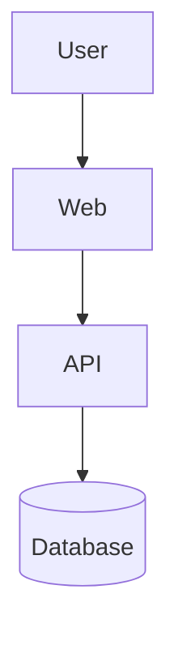

# PRD: <Project Name>

## Executive Summary

<!-- Product name, target users, problem being solved, and MVP success statement. -->
<!-- The success statement should be measurable: "We succeed when X users can do Y without Z." -->

**Product**: 
**Users**: 
**Problem**: 
**MVP success**: 

---

## Principles

<!-- 3–5 guiding decisions that settle future trade-offs. -->
<!-- Example: "Prefer async over blocking", "Zero config for the happy path", "Mobile-first layout" -->

1. 
2. 
3. 

---

## Users

| User Role | Goal | Pain Point Today |
| --------- | ---- | ---------------- |
| | | |

---

## MVP Scope

### In Scope

<!-- Explicit list of features and behaviors that will ship. -->

- 

### Out of Scope (MVP)

<!-- Explicit list of what will NOT be built. This prevents scope creep. -->

- 

---

## Functional Requirements

<!-- Per user role or per module. Each requirement needs acceptance criteria. -->

### <Module or User Role>

1. **<Feature>**
   - Description: 
   - Acceptance criteria:
     - [ ] 
     - [ ] 

---

## System Architecture

<!-- How apps, services, and packages connect. Data flow. Key decisions. -->

Key decisions:
-

---

## API and Data Contracts

### Key Endpoints

| Method | Path | Auth | Purpose |
| ------ | ---- | ---- | ------- |
| | | | |

### Core Data Entities

<!-- Describe main entities and their key relationships. -->

| Entity | Key Fields | Relationships |
| ------ | ---------- | ------------- |
| | | |

---

## Security and Authorization

**Auth model**: <!-- JWT / session / OAuth / API key -->

**Authorization matrix**:

| Role | Can | Cannot |
| ---- | --- | ------ |
| | | |

**Sensitive data**:
- 

**Compliance requirements**: <!-- GDPR / PCI / HIPAA / none -->

---

## Non-Functional Requirements

| Requirement | Target |
| ----------- | ------ |
| API response time (p95) | |
| Uptime | |
| Concurrent users (MVP) | |
| Browser support | |
| Mobile support | |

---

## Success Metrics

| Metric | Baseline | MVP Target |
| ------ | -------- | ---------- |
| | | |

---

## Phased Roadmap

| Phase | Goal | Key Deliverables | Target |
| ----- | ---- | ---------------- | ------ |
| MVP | | | |
| v1.1 | | | |

---

## Risks and Mitigations

| Risk | Likelihood | Impact | Mitigation |
| ---- | ---------- | ------ | ---------- |
| | | | |

---

## GitHub Collaboration

- **Labels**: `feat`, `bug`, `task`, `docs`, `qa`, `infra`, `blocked`, `needs-triage`
- **Issue types**: bug / feature / task (see `.github/ISSUE_TEMPLATE/`)
- **Sprint model**: <!-- 1-week / 2-week / kanban -->
- **Sprint board**: <!-- GitHub Project URL -->
- **Review owners**: <!-- who reviews what -->
