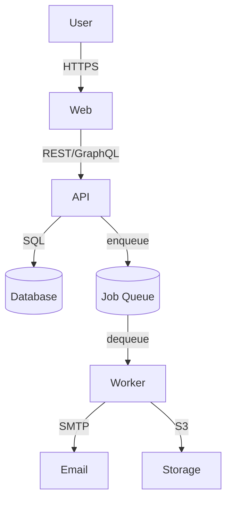

# Architecture Reference

> Generated by `/create-rules`. Update this when architecture changes.

## System Shape

<!-- Describe all deployable units: apps, services, packages, workers. -->
<!-- One line per unit: name — what it does — what it owns. -->

| Unit | Role | Owns |
| ---- | ---- | ---- |
| | | |

## Runtime Architecture

## Module / Package Responsibilities

<!-- For each module or package, what it owns and what it must never touch. -->

| Module | Owns | Must Not Touch |
| ------ | ---- | -------------- |
| | | |

## Boundary Rules

<!-- Import rules. These enforce the architecture. -->

- <!-- e.g. "Controllers import services only — never repositories directly" -->
- <!-- e.g. "Shared packages must not import from apps" -->
- <!-- e.g. "Cross-module side effects go through the event bus or queues" -->
- <!-- e.g. "Web app has no direct database connection" -->

## Critical Flows

<!-- The top 3–7 paths through the system. Include async flows. -->

1. **<Flow name>**: `User → Web → API → DB`
   - <!-- Brief description of what happens at each step -->

2. **<Flow name>**:
   - 

## Known Architectural Risks

<!-- Things that may need to change as the system scales. -->

-
