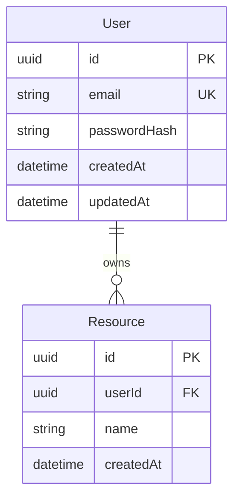

# Database Reference

> Generated by `/create-rules`. Update this when the schema changes.

## Principles

- <!-- e.g. "All migrations are additive and reversible in the same PR" -->
- <!-- e.g. "Unique constraints and foreign keys enforced at DB level, not only in app" -->
- <!-- e.g. "Never delete a column — mark it deprecated first, remove in a later release" -->
- <!-- e.g. "Soft-delete with deletedAt timestamp, not hard DELETE" -->
- <!-- e.g. "Money stored as integer (cents / paise), never float" -->

## ORM / Query Tool

- **Tool**: <!-- Prisma | Drizzle | TypeORM | SQLAlchemy | GORM | Diesel | SQLC -->
- **Schema file**: <!-- path/to/schema.prisma or equivalent -->
- **Migration commands**:

```bash
# Generate a migration
<migrate generate command>

# Apply migrations
<migrate apply command>

# Reset database (dev only)
<reset command>

# Seed
<seed command>
```

## Entity Map



## Models

<!-- One section per table. List all fields with type, nullable, default, notes. -->

### User

| Field | Type | Nullable | Default | Notes |
| ----- | ---- | -------- | ------- | ----- |
| id | uuid | No | gen() | Primary key |
| email | string | No | — | Unique |
| passwordHash | string | No | — | bcrypt |
| createdAt | datetime | No | now() | |
| updatedAt | datetime | No | auto | |

### <ModelName>

| Field | Type | Nullable | Default | Notes |
| ----- | ---- | -------- | ------- | ----- |
| | | | | |

## Indexes and Constraints

| Table | Index / Constraint | Type | Purpose |
| ----- | ------------------ | ---- | ------- |
| users | email | UNIQUE | Prevent duplicate accounts |
| | | | |

## Migration Rules

- One logical change per migration file.
- Migrations must be forward-only in production (no `down` that loses data).
- Test migrations on a copy of production data before applying to prod.
- Never run `DROP COLUMN` in the same migration that removes it from the app — give time for rollback.
- For large table changes, use batched migrations and maintenance windows.

## Sensitive Data

| Column | Sensitivity | Storage method |
| ------ | ----------- | -------------- |
| passwordHash | High | bcrypt |
| paymentToken | High | encrypted at rest |
| email | Medium | plaintext |
