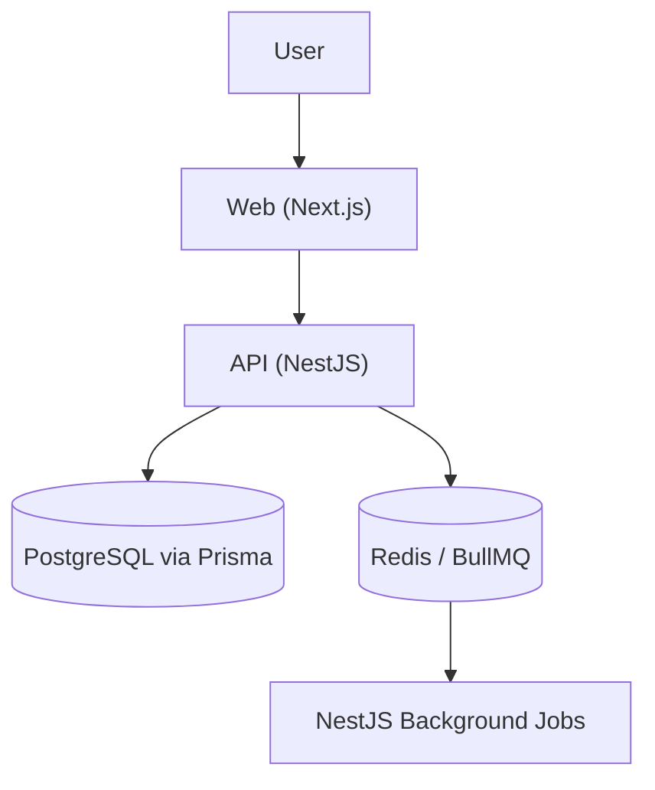

# CONSTITUTION.md

This file governs all AI-agent and human contributor behavior in this repository. Agents read this on every session to understand what they are building, how the system works, and what rules are non-negotiable.

---

## Project Overview

- **Product**: Infinito 2K26 Campus Ambassador Portal
- **Users**: Campus Ambassadors and Event Administrators
- **Problem**: Managing campus ambassador registrations, tasks, and leaderboards for Infinito 2K26.
- **Phase**: Production
- **Team size**: UNKNOWN — needs human input
- **Repository**: UNKNOWN — needs human input

---

## Architecture North Star

The repository is structured as a Turborepo monorepo with separate frontend and backend applications.



Key boundaries:
- Controllers are thin — business logic lives in NestJS services.
- Data validation happens via DTOs and class-validator/zod.
- Frontend uses standard Next.js patterns.
- Direct database access from the web app is prohibited; all data must flow through the API.

---

## Tech Stack

| Area | Technology | Version | Purpose |
| ---- | ---------- | ------- | ------- |
| Runtime | Node.js | >=18 (20 in CI) | |
| Web framework | Next.js | 16.2.0 | Frontend application |
| API framework | NestJS | 11.0.1 | Backend application |
| Database | PostgreSQL | | Persistent data storage |
| ORM / query builder | Prisma | 7.8.0 | Database access and migrations |
| Queue / cache | BullMQ & Redis | | Background tasks and caching |
| Auth | Passport / JWT | | User authentication |
| Unit testing | Jest | 30.0.0 | API unit tests |
| E2E testing | Jest | | API E2E tests |
| CI/CD | GitHub Actions | | Automated checks and deployment |
| Package Manager | npm + Turborepo| | Workspace management |

---

## Commands

```bash
# Install dependencies
npm ci

# Start development
npm run dev

# Build
npm run build

# Lint
npm run lint

# Typecheck
npm run check-types

# Unit tests
npm run test --workspace=api

# Database: migrate
npm run prisma:migrate --workspace=api

# Database: seed / reset
npm run db:seed
```

---

## Project Structure

```text
apps/
  api/         — NestJS backend API
  web/         — Next.js frontend
packages/      — shared code (ui, types, configs)
.claude/       — AI workflow scaffold
.github/       — CI and templates
```

---

## Code Rules

### General

- Scope changes to the active issue. Do not refactor unrelated code.
- Match existing patterns in the file being edited.
- No new libraries without an issue and approval.
- Update `.claude/reference/` docs when architecture, API, schema, or testing contracts change.
- Add tests proportional to the risk of the change.
- Never commit `.env`, secrets, API keys, or credentials.

### Backend

- Business logic lives in services, not controllers.
- Use DTOs with `class-validator` or `zod` for request validation.
- Background jobs must be queued via BullMQ.

### Frontend

- Next.js conventions must be respected.
- Share UI components from `packages/ui` where possible.
- Adhere to the ESLint and TypeScript configs provided in the repo.

### Database

- All database operations are handled by Prisma.
- Migrations must be generated for all schema changes (`prisma migrate dev`).

---

## GitHub Workflow

- Every unit of work starts as a GitHub issue.
- Every code change ships through a PR linked to an issue.
- Branch naming: `<type>/<kebab-case-description>`
  - Examples: `feat/user-auth`, `fix/payment-webhook`, `chore/upgrade-deps`
- PR title follows Conventional Commits format: `<type>(<scope>): <description>`
- Required checks before merge: lint, typecheck, build, tests.
- Do not merge without passing checks and at least one approval.
- Do not push directly to `main`.

---

## Team

| Role | Handle | Owns |
| ---- | ------ | ---- |
| Lead | UNKNOWN | UNKNOWN |

---

## Validation Gate

The following must pass before any commit is handed off for review:

```bash
npm run lint
npm run check-types
npm run build
npm run test --workspace=api
```

---

## Non-Negotiables

Rules that must never be broken regardless of deadline pressure:

1. Never skip the validation gate commands before a commit.
2. Never commit secrets, credentials, or `.env` files.
3. API code must always pass type checking and linting.
