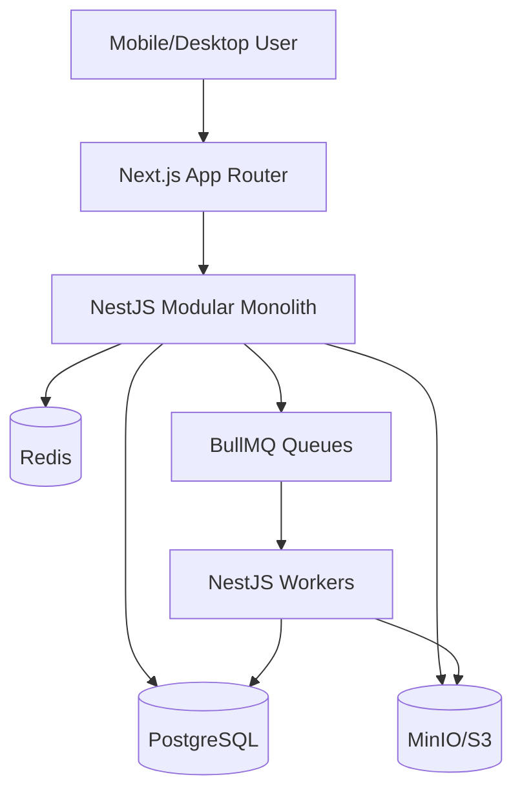

# Product Requirements Document: Infinito 2K26 Platform

## 1. Executive Summary

Infinito 2K26 is IIT Patna's annual sports fest platform. The product must support public discovery, event registration, team formation, payments, QR-based identity, volunteer check-in, admin operations, live updates, and reporting.

The MVP succeeds when participants can discover events, register individually or as teams, complete payment, receive a verifiable QR credential, and be checked in by volunteers, while organizers can manage events, registrations, and operational status from admin dashboards.

## 2. Product Principles

- Reliability over flash: registration and check-in must work during peak load.
- Mobile-first by default: most participants and volunteers will use phones.
- Operational clarity: admins need dashboards that reveal blocked payments, pending registrations, capacity, and check-in status.
- No single point of failure: work is delegated through issues, PRs, docs, and repeatable workflows.

## 3. Primary Users

| User              | Core Need                                                  |
| ----------------- | ---------------------------------------------------------- |
| Visitor           | Discover fest details and available sports/events          |
| Participant       | Register, pay, join teams, access QR credential            |
| Team Captain      | Manage team members and registration status                |
| Campus Ambassador | Track referred registrations                               |
| Volunteer         | Scan QR codes and check in participants                    |
| Event Manager     | Manage schedules, teams, scores, and venue operations      |
| Admin             | Configure events, review registrations, reconcile payments |
| Super Admin       | Manage roles, audit activity, and global settings          |

## 4. MVP Scope

| Module       | In Scope                                                   | Out of Scope for MVP        |
| ------------ | ---------------------------------------------------------- | --------------------------- |
| Public Web   | Landing, event list, event detail, basic SEO               | Editorial CMS               |
| Auth         | Register, login, refresh, logout, RBAC                     | SSO/MFA                     |
| Events       | Admin CRUD, public listing, capacity metadata              | Fully dynamic rule engine   |
| Registration | Individual/team registration, duplicate protection         | Advanced waitlists          |
| Payments     | Razorpay order, webhook verification, reconciliation hooks | Refund automation           |
| QR Identity  | Signed credential generation, display, validation          | Native mobile wallet passes |
| Admin        | Registration/payment views, basic metrics                  | Full BI suite               |
| Ops          | Health checks, structured errors, local infra              | Multi-region deployment     |

## 5. Functional Requirements

1. Users can register and log in securely.
2. Public users can browse published events.
3. Admins can create and update events without code changes.
4. Team captains can create teams and invite participants.
5. Participants can initiate registration and payment.
6. Payment webhooks are verified and idempotent.
7. Confirmed registrations generate QR credentials asynchronously.
8. Volunteers can validate QR credentials.
9. Admins can view registration and payment status.
10. All critical operations produce structured logs and auditable state changes.

## 6. Architecture

## 7. Success Metrics

- Registration path completes without manual admin intervention.
- Duplicate team/event registrations are rejected by database constraints.
- Payment webhook retries do not create duplicate confirmations.
- QR credentials are generated asynchronously after confirmation.
- Core pages work on mobile viewport widths.
- Lint, typecheck, build, and API tests pass in CI.

## 8. Phase Plan

| Phase   | Goal                      | Core Deliverables                                           |
| ------- | ------------------------- | ----------------------------------------------------------- |
| Phase 0 | Infrastructure baseline   | Docker Compose, env blueprint, repo rules                   |
| Phase 1 | Core scaffolding          | Config, Prisma, health, response envelope, exception filter |
| Phase 2 | Identity and events       | Auth, users, RBAC, events CRUD                              |
| Phase 3 | Registration and payments | Teams, registrations, Razorpay, webhook idempotency         |
| Phase 4 | QR and admin              | Credential generation, scanner, admin dashboards            |
| Phase 5 | Fest operations           | Scheduling, live scores, leaderboards, observability        |
| Phase 6 | Launch hardening          | Load tests, backups, monitoring, security audit             |

## 9. Collaboration Requirements

- Every deliverable must map to a GitHub issue.
- Every issue needs owner, priority, acceptance criteria, and track.
- Every PR must link its issue and include validation output.
- Architecture/API/database changes must update `reference/`.
